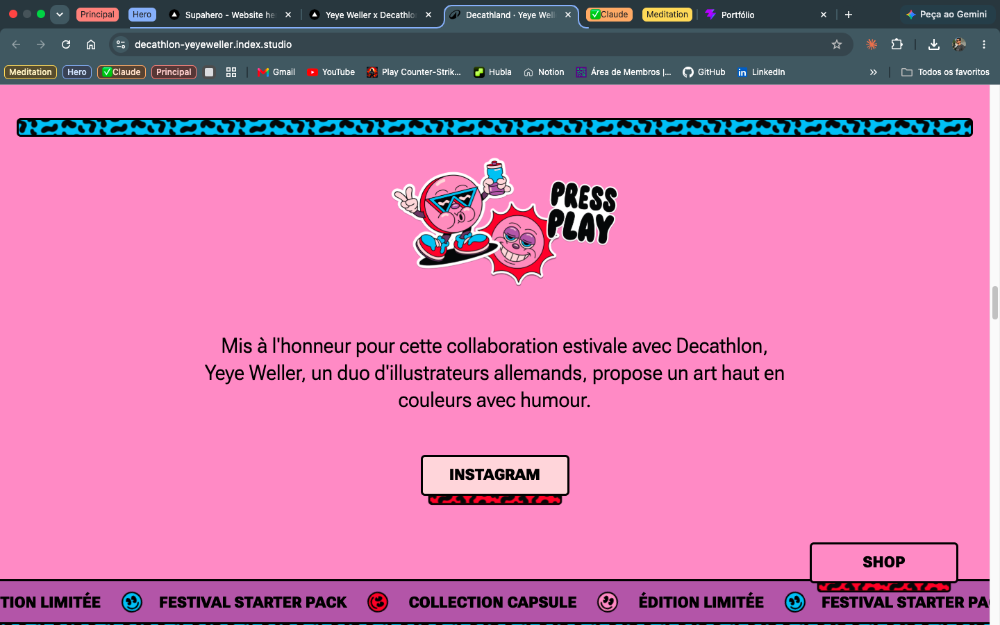

# Referência visual

Site de referência: https://decathlon-yeyeweller.index.studio/
Prints em reference/. É referência de ideia, não de conteúdo.

## Vibe

Alegre, colorida e descontraída. Os prints 02, 04 e 05, em conjunto,
mostram essa vibe.

## O que é referência

- Hero (print 01)
- Seção de projetos (print 03)
- Troca de cor de fundo entre seções (prints 02, 04 e 05)

## How to conduct

- For any layout, spacing, color, typography or motion decision, read
  reference/DESIGN.md and the prints in reference/ first. If they
  don't cover what's needed, say so and ask him — never invent visual
  details.

## Hero (print 01)

- No topo, centralizado, só o nome "Victor de Luna Freire" (no lugar
  dos dois logos da referência).
- A palavra "portfólio" no lugar de "DECATHLAND", com a mesma
  responsividade das letras ao mouse da referência.
- Personagem principal: ainda a definir.
- Duas fotos do conteúdo na posição do bloco "NOUVELLE COLLECTION" +
  SHOP do hero de referência, seguindo a ideia desse bloco.

### Movimento das nuvens (hero)

- Loop infinito, todas vindo da esquerda para a direita.
- Todas passam na frente do boneco animado, cobrindo-o parcialmente
  em pontos distintos.
- No título, uma nuvem passa pela frente e outra por trás.

## Projetos (print 03)

- Cada projeto usa o mesmo padrão das mercadorias do print: uma imagem
  com borda colorida (cor da paleta) que reage ao mouse e mostra outra
  foto do mesmo projeto.
- Cada projeto tem uma legenda e uma sublegenda (descrição breve do site).

## Seções (prints 02, 04 e 05)

A cor de fundo muda de uma seção para outra para marcar cada uma,
usando as cores da própria paleta. As cores estão no index.css.

## Tipografia

Fonte de título já instalada: Titan One ou Bagel Fat One (`--font-title`).

## Fica para depois

Ícones, bonecos, seus efeitos e os movimentos das demais seções.
Serão definidos depois de criados os elementos.

## Tipografia

| Papel               | Valor                      |
| ------------------- | -------------------------- |
| Título hero         | `clamp(4rem, 17vw, 21rem)` |
| Título de seção     | `clamp(3rem, 14vw, 16rem)` |
| Legenda de projeto  | 1.625rem                   |
| Corpo               | 1.625rem                   |
| Sublegenda / rótulo | 0.875rem                   |
| Botão               | 1.25rem                    |

Sem escada de breakpoint — `vw` e valores fixos resolvem.

## Espaçamento

| Uso                 | Mobile  | md     | lg     |
| ------------------- | ------- | ------ | ------ |
| Respiro lateral     | a1.5rem | 1.5rem | 4rem   |
| Espaço entre seções | 3rem    | 5rem   | 7rem   |
| Gap entre cards     | 1.5rem  | 2rem   | 2.5rem |

Respiro lateral no mobile fica por amostragem. As duas últimas linhas são hipótese — não deu pra medir nos prints.

## Layout por seção

| Seção    | Mobile                      | md        | lg          |
| -------- | --------------------------- | --------- | ----------- |
| Hero     | empilhado                   | empilhado | lado a lado |
| Projetos | 1 coluna                    | 2 colunas | 4 colunas   |
| Stack    | carrossel, sem largura fixa | igual     | igual       |

## Contato

### Referência

Seção "Press Play" do site Decathlon x Yeye Weller. Pontos que importam da referência:

- Fundo rosa chapado, com uma ilustração central e um texto curto de apresentação logo abaixo.
- Faixas decorativas estampadas (azul e preto) marcando o início e o fim da seção.
- Faixa em marquee logo abaixo, com texto em caixa alta e ícones.

### Ideia

A referência usa um único botão ("INSTAGRAM"). No portfólio, esse botão único vira **um conjunto de botões de ícone**, um para cada meio de contato. Cada ícone é o próprio botão e o disparo da ação, sem texto de apoio obrigatório.

Os botões são imagens svg, com cantos arredondados, sem borda, com aspecto de adesivo

### Contatos

| Meio           | Ação do botão            | Destino                                          |
| -------------- | ------------------------ | ------------------------------------------------ |
| E-mail (Gmail) | Abre o cliente de e-mail | `mailto:victordelunafreire@gmail.com`            |
| LinkedIn       | Abre em nova aba         | `https://www.linkedin.com/in/victordelunafreire` |
| GitHub         | Abre em nova aba         | `https://github.com/victordelunafreire-rgb`      |

### Pendente

- WhatsApp: ainda não definido (falta número ou link `wa.me`). Só entra na tabela quando for confirmado.

## Hero images

Three separate assets make up the hero character. They are exported
separately on purpose, so each one can be sized, positioned and
animated independently.

| Layer      | Format                      | Description                |
| ---------- | --------------------------- | -------------------------- |
| Bust       | PNG, transparent background | src/assets/hero/Davi       |
| Sunglasses | PNG, transparent background | src/assets/hero/rayban     |
| Bubblegum  | SVG                         | src/assets/hero/bubble_gum |

Stacking order: bust at the back, sunglasses and bubblegum on top.

Visual contrast: bust and sunglasses are photographic, bubblegum is a
flat illustration.

The Figma composition is the reference for how the three layers sit
relative to each other (relative position and size).
